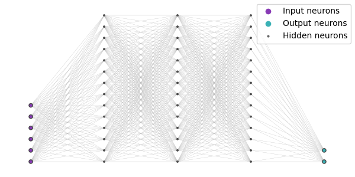
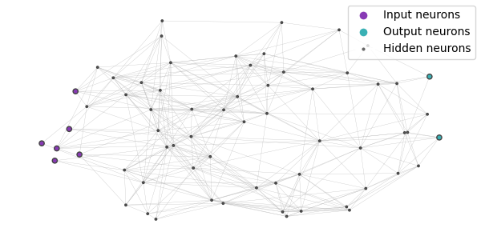
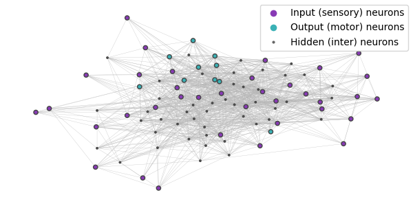
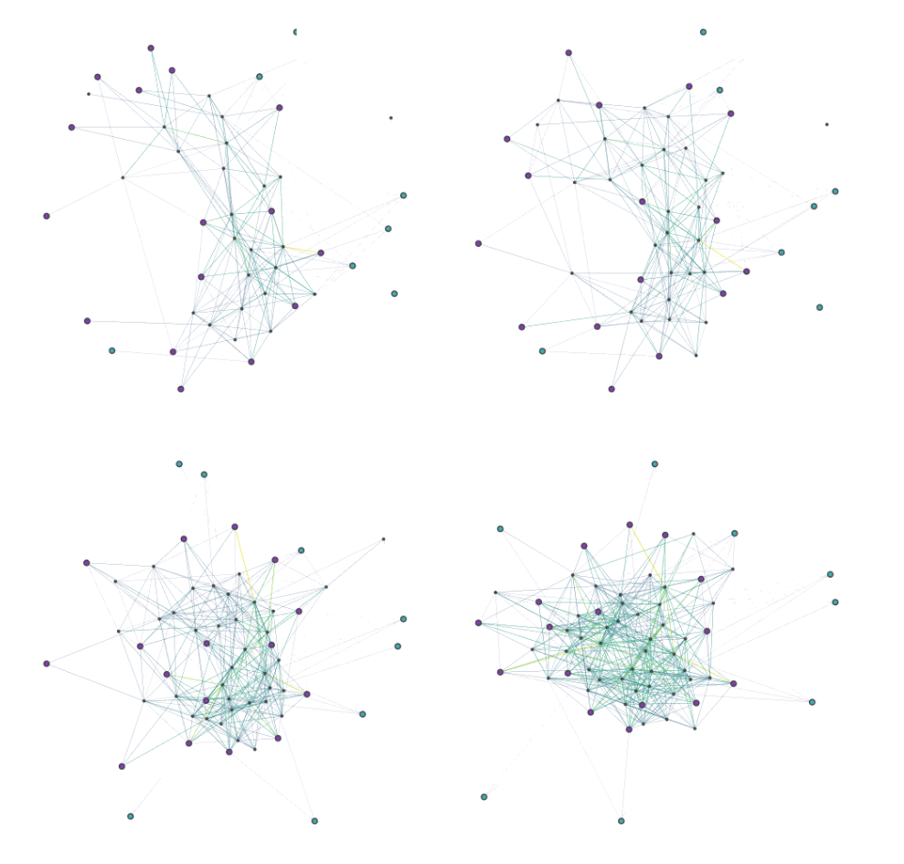
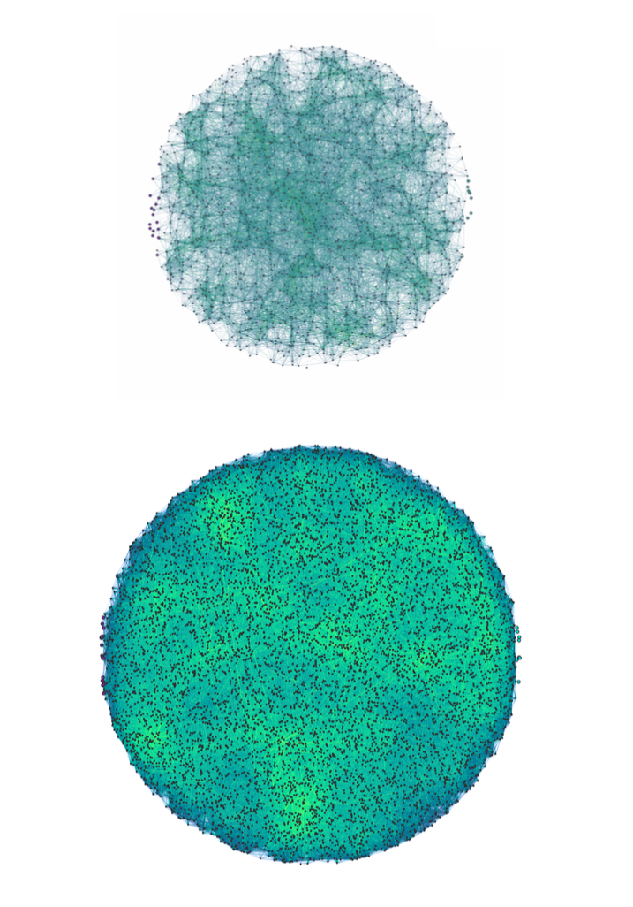

# ANT | Artificial Neural Topology

### Artificial Neural Topology (ANT) is a time-state preserving topological analogy to biological neural networks

Rapid development in artificial intelligence (AI) research has led to increasingly larger artificial neural networks (ANNs). Some of the largest ANNs now have parameter sizes that rival the neuron and synaptic counts of intelligent biological organisms. However, these models have yet to demonstrate the ca- pacity to reason in areas outside of their training domain, leaving a gap in AI research efforts towards artificial general intelligence (AGI). The combined inability of ANNs to replicate the complex graph structure and temporal statefulness of information travel in biological neural circuits we believe results in ANN hypothesis classes that are too narrow for general reasoning. To address both of these issues, we propose ANT, a stateful, toplogoically nonlinear network formulation. ANT demonstrates superior performance and task-generalizable capabilities in reinforcement learning (RL) settings compared to conventional artificial neural networks.

  
  
<b>Figure 1:</b> ANN topology

  
  
<b>Figure 2:</b> ANT topology

  
  
<b>Figure 3:</b> Subgraph of <i>C. elegans</i> neural topology

  
  
<b>Figure 4:</b> Evolution of a small ANT

  
  
<b>Figure 5:</b> Evolution of a large ANT

